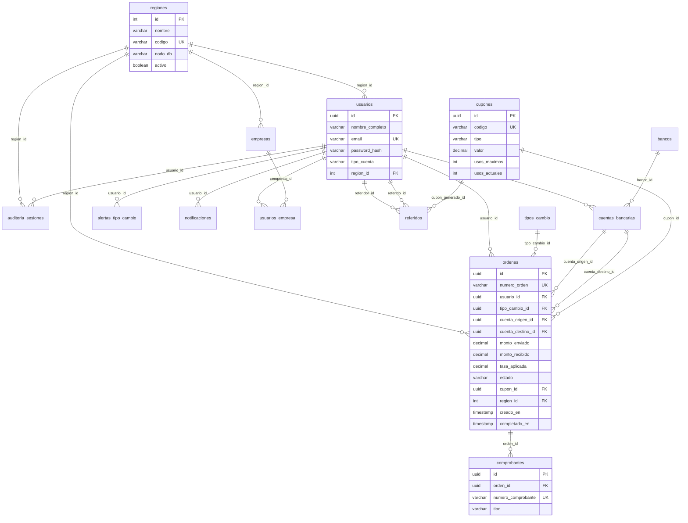

# Diagrama Entidad-Relación — TeCambioYa (PC3)

## Modelo relacional (PostgreSQL — 14 tablas)

## Tabla más detallada: `ordenes`

Contiene **50 filas** de demostración (migración `V2__pc3_datos_demostracion.sql`).

Campos clave: montos, tasas, estados, cuentas origen/destino, cupón, región, fechas.

## Base de datos distribuida (Fase 2)

| Tipo | Tablas | Estrategia |
|------|--------|------------|
| Replicadas | regiones, bancos, tipos_cambio, cupones, empresas | Misma copia en 3 nodos |
| Fragmentadas | usuarios, cuentas_bancarias, ordenes, comprobantes, notificaciones | Por `region_id` (Lima/Arequipa/Trujillo) |

Scripts manuales por nodo: `src/main/resources/db/manual/nodos/`

## MongoDB (Fase 3 — datos no estructurados)

Colección `notificaciones_push`: chat, alertas push, metadata flexible.

Ver: `src/main/resources/mongodb/init-collections.js`
